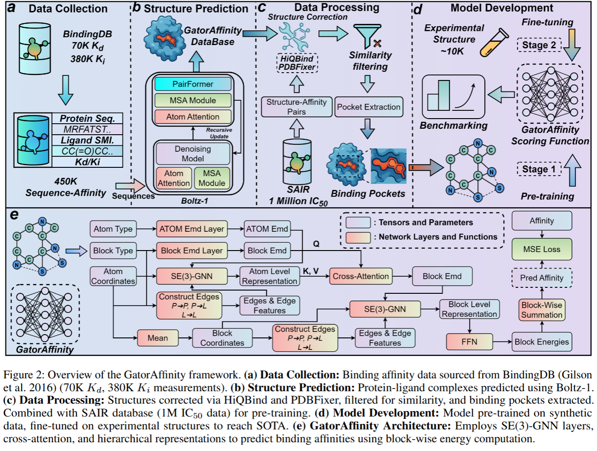
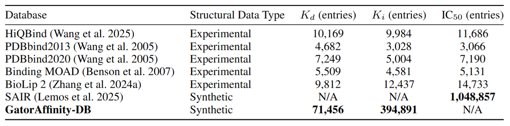
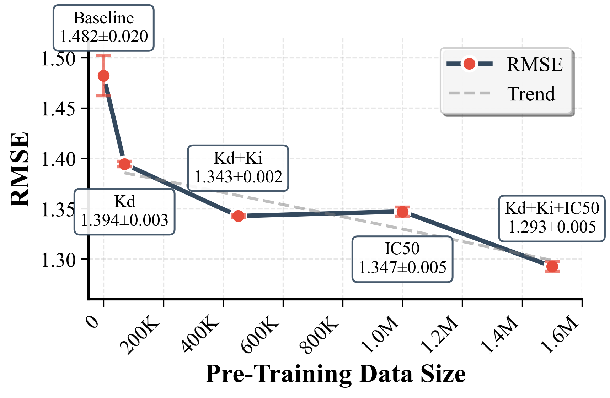
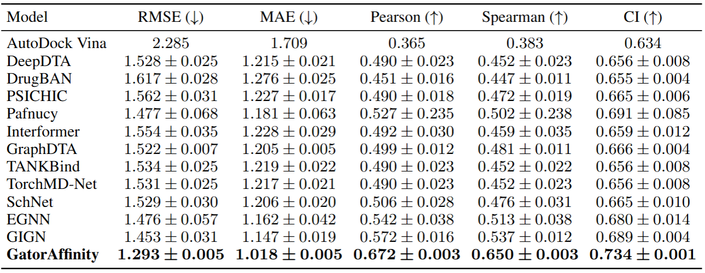

# GatorAffinity: Boosting the Protein-Ligand Binding Affinity Prediction with Synthetic Structural Data


A geometric deep learning model for protein-ligand binding affinity prediction, leveraging **large-scale synthetic structural data**.



## Synthetic Dataset at Scale



- **450K+ Kd/Ki complexes** generated using Boltz-1 [[4]](#references) structure prediction 
- **1M+ IC50 complexes** from SAIR database [[1]](#references)  
- **Total: 1.5M synthetic protein-ligand pairs for pre-training**
<div style="text-align: center;">
  
</div>

## Installation

### Environment:
```bash
git clone https://github.com/AIDD-LiLab/GatorAffinity.git
cd GatorAffinity
bash environment.sh
```

### Data Download

#### Original Structural Data
1. **[GatorAffinity-DB Complete Original Data](https://huggingface.co/datasets/AIDD-LiLab/GatorAffinity-DB)**
2. **[SAIR Complete Original Data](https://www.sandboxaq.com/sair)**

#### Preprocessed Data
1. **[Kd+Ki+IC50 For Pre-training](https://huggingface.co/datasets/AIDD-LiLab/GatorAffinity-Processed-Data)**
2. **filtered LP-PDBbind For Fine-tuning** - `./LP-PDBbind`


## Model Checkpoints

### Pre-trained Models
- **Base model**: Pre-trained on IC50+Kd+Ki datasets  
  `./model_checkpoints/Kd+Ki+IC50_pretrain.ckpt`

- **Fine-tuned model** (best performance): Pre-trained on IC50+Kd+Ki, fine-tuned on experimental structures with LP-PDBbind split  
  `./model_checkpoints/Kd+Ki+IC50_experimental_fine_tuning.ckpt`

### ATOMICA Backbone
ATOMICA-Universal atomic scale molecular interaction representation model used as GatorAffinity's backbone.  
**[Download ATOMICA Checkpoints](https://huggingface.co/ada-f/ATOMICA/tree/main/ATOMICA_checkpoints/pretrain)**

**Note**: Our experiments show that ATOMICA backbone significantly improves performance with limited pre-training structures, though benefits diminish as synthetic training data increases.


## Usage


### Training
```bash
python train.py \
    --train_set_path LP-PDBbind/train.pkl \
    --valid_set_path LP-PDBbind/valid.pkl \
    --pretrain_ckpt model_checkpoints/Kd+Ki+IC50_pretrain.ckpt
```

### Inference
```bash
python inference.py \
    --model_ckpt model_checkpoints/Kd+Ki+IC50_experimental_fine_tuning.ckpt \
    --test_set_path LP-PDBbind/test.pkl
```

### Custom Data Processing

GatorAffinity supports processing your own PDB data for training and inference.

#### Data Format

Create a CSV file with the following columns for combined processing:

| Column | Description | Example |
|--------|-------------|---------|
| `pdb_file` | Path to PDB file | `/path/to/pdbs/1abc.pdb` |
| `pdb_id` | PDB identifier | `1abc` |
| `pocket_chain` | Protein chain(s) for pocket | `A` or `A_B` for multiple chains |
| `lig_code` | Ligand residue name | `LIG`, `ATP`, `GDP` |
| `lig_chain` | Ligand chain | `C`, `L` |
| `smiles` | Ligand SMILES string | `CCO`, `c1ccccc1` |
| `lig_resi` | Ligand residue number | `1`, `100` |

#### Processing Your Data

```bash
python data/process_pdbs.py \
    --data_index_file your_data.csv \
    --out_path processed_data.pkl \
    --fragmentation_method PS_300

# The script automatically detects the format and processes accordingly
```

#### Example CSV Content

```csv
pdb_file,pdb_id,pocket_chain,lig_code,lig_chain,smiles,lig_resi
/path/to/pdbs/1abc.pdb,1abc,A,LIG,C,CCO,1
/path/to/pdbs/2def.pdb,2def,A_B,ATP,L,c1nc2c([nH]1)N(C(=O)N2)C,100
```


## Performance

**State-of-the-art on filtered LP-PDBbind [[2]](#references):**



## License

This repository is licensed under two different licenses:

### Main Repository - MIT License
The source code, documentation, and most files are licensed under the [MIT License](./LICENSE).

### Model Checkpoints - CC BY-NC-SA 4.0
The model checkpoints in the `./model_checkpoints/` directory are licensed under the [Creative Commons Attribution-NonCommercial-ShareAlike 4.0 International License](./model_checkpoints/LICENSE).

**Model checkpoints:**
- `Kd+Ki+IC50_pretrain.ckpt`
- `Kd+Ki+IC50_experimental_fine_tuning.ckpt`

### Other Data
For the license of other data, please refer to the specific license file provided by the repository.

<mark>
## Citation
</mark>

```bibtex
@article{gatoraffinity2025,
  title={GatorAffinity: Boosting the Protein-Ligand Binding Affinity Prediction with Synthetic Structural Data},
  author={Anonymous},
  journal={Arxiv},
  year={2025}
}
```

## References

[1] Lemos, P., Beckwith, Z., Bandi, S., Van Damme, M., Crivelli-Decker, J., Shields, B.J., Merth, T., Jha, P.K., De Mitri, N., Callahan, T.J., et al. (2025). SAIR: Enabling deep learning for protein-ligand interactions with a synthetic structural dataset. *bioRxiv*.

[2] Wang, Y., Sun, K., Li, J., Guan, X., Zhang, O., Bagni, D., Zhang, Y., Carlson, H.A., Head-Gordon, T. (2025). A workflow to create a high-quality protein–ligand binding dataset for training, validation, and prediction tasks. *Digital Discovery*, 4(5), 1209-1220.

[3] Fang, A., Zhang, Z., Zhou, A., and Zitnik, M. (2025). ATOMICA: Learning Universal Representations of Intermolecular Interactions. *bioRxiv*.

[4] Wohlwend, J., Corso, G., Passaro, S., Reveiz, M., Leidal, K., Swiderski, W., Portnoi, T., Chinn, I., Silterra, J., Jaakkola, T., et al. (2024). Boltz-1: Democratizing biomolecular interaction modeling. *bioRxiv*.

## Acknowledgments

This work builds upon [ATOMICA](https://github.com/mims-harvard/ATOMICA) framework. We thank the ATOMICA authors for making their codebase available.
