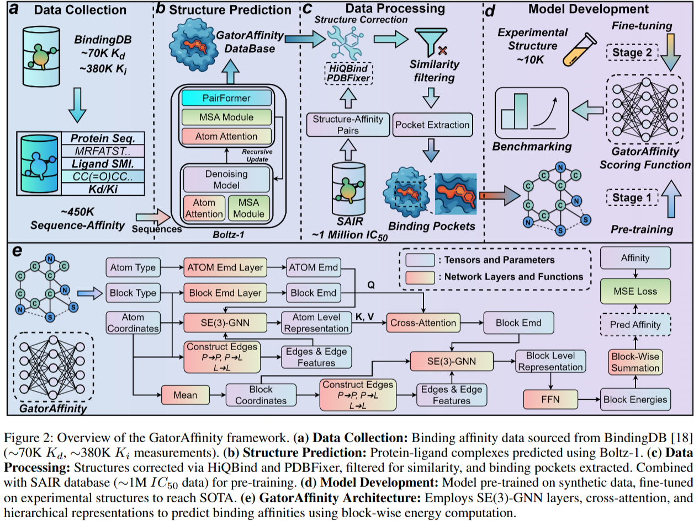

# GatorAffinity

A geometric deep learning model for protein-ligand binding affinity prediction, leveraging **unprecedented large-scale synthetic structural data**.

## Breakthrough: Synthetic Dataset at Scale


- **450K+ $K_{d}/K_{i}$ complexes** generated using Boltz-1 structure prediction [[4]](#references)
- **1M+ $IC_{50}$ complexes** from SAIR database [[1]](#references)
- **Total: 1.5M synthetic protein-ligand pairs for pre-training**


## Installation

### Clone the GitHub Repository:
```bash
git clone https://github.com/AIDD-LiLab/GatorAffinity.git
cd GatorAffinity
bash environment.sh
```

### Data Download

<!-- This section is intentionally left blank for the user to fill in -->

## Usage

### Training
```bash
python train.py --train_set_path train.pkl --valid_set_path valid.pkl --pretrain_ckpt check_points/epoch6_step1148.ckpt
```

### Inference
```bash
python inference.py --model_ckpt check_points/epoch6_step1148.ckpt --test_set_path test_data/test.pkl
```


### Custom Data Processing

<!-- This section is intentionally left blank for the user to fill in -->

## Performance

**State-of-the-art on filtered LP-PDBBind [[2]](#references):**


## Citation

```bibtex
@article{gatoraffinity2025,
  title={GatorAffinity: Boosting the Protein-Ligand Binding Affinity Prediction with Synthetic Structural Data},
  author={Anonymous},
  journal={Arxiv},
  year={2024}
}
```


## References

[1] Lemos, P., Beckwith, Z., Bandi, S., Van Damme, M., Crivelli-Decker, J., Shields, B.J., Merth, T., Jha, P.K., De Mitri, N., Callahan, T.J., et al. (2025). SAIR: Enabling deep learning for protein-ligand interactions with a synthetic structural dataset. *bioRxiv*.

[2] Wang, Y., Sun, K., Li, J., Guan, X., Zhang, O., Bagni, D., Zhang, Y., Carlson, H.A., Head-Gordon, T. (2025). A workflow to create a high-quality protein–ligand binding dataset for training, validation, and prediction tasks. *Digital Discovery*, 4(5), 1209-1220.

[3] Fang, A., Zhang, Z., Zhou, A., and Zitnik, M. (2025). ATOMICA: Learning Universal Representations of Intermolecular Interactions. *bioRxiv*.

[4] Wohlwend, J., Corso, G., Passaro, S., Reveiz, M., Leidal, K., Swiderski, W., Portnoi, T., Chinn, I., Silterra, J., Jaakkola, T., et al. (2024). Boltz-1: Democratizing biomolecular interaction modeling. *bioRxiv*.

## Acknowledgments

This work builds upon the ATOMICA framework [[3]](#references) for learning universal representations of intermolecular interactions. We thank the ATOMICA authors for making their codebase available at https://github.com/mims-harvard/ATOMICA.
